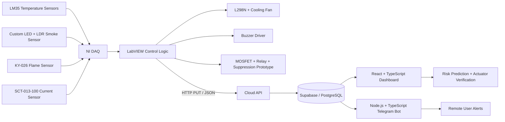

# 🔥 Smart Fire Detection and Automatic Suppression System for Electrical Distribution Boards

> A low-cost, AI-assisted IoT system for early fire-risk detection, real-time monitoring, automatic response, and remote notification in electrical distribution boards.

## 🌐 Live Dashboard

**Website:** https://smart-monitoring-system-self.vercel.app/

## 👥 Project Team

- **230491J — PIRIYATHARSAN M.**
- **230496E — PRABHATH U.L.K.**
- **230504F — PUSSALLA P.G.D.C.**

---

## 📌 Project Overview

Electrical distribution boards can develop dangerous conditions such as loose connections, overloaded circuits, damaged insulation, arc faults, short circuits, component aging, dust accumulation, and excessive heat.

Traditional devices such as MCBs, RCCBs, and fuses mainly protect against electrical faults. They do not directly monitor the complete fire-development sequence:

**Electrical fault → Heat generation → Smoke → Flame → Complete DB fire**

This project therefore monitors the conditions that lead to fire, rather than relying only on overcurrent or earth-leakage protection.

The final prototype combines:

- Temperature monitoring
- Custom smoke detection
- Flame detection
- Current monitoring
- LabVIEW-based control logic
- Automatic fan control
- Buzzer alarm
- Automatic fire-suppression prototype
- Cloud data transfer
- Live web monitoring
- Telegram alerts
- Actuator-health verification
- AI-assisted fire-risk prediction

---

## 🎯 Objectives

- Detect fire risk before flame fully develops.
- Continuously monitor electrical distribution-board conditions.
- Detect abnormal temperature, smoke, flame, and current behaviour.
- Reduce heat build-up using automatic cooling-fan control.
- Generate an alarm during abnormal/fire conditions.
- Automatically operate a fire-suppression mechanism when required.
- Notify users remotely.
- Provide AI-assisted early warning using correlated sensor trends.
- Verify whether actuators are operating as expected.
- Log data for calibration, analysis, and future model improvement.

---

## 🏗️ System Architecture



### One-line summary

**LabVIEW senses and controls the hardware, the cloud stores the data, the website monitors and verifies the system, the AI layer predicts rising fire risk, and the Telegram bot delivers remote alerts.**

---

## 🧰 Main Components

### Sensors

| Sensor | Purpose |
|---|---|
| **LM35** | Measures temperature inside/outside the distribution board |
| **Custom LED + LDR smoke sensor** | Detects smoke using light scattering |
| **KY-026** | Detects flame |
| **SCT-013-100** | Measures AC current |

### Actuators / Driver Hardware

| Component | Purpose |
|---|---|
| Cooling fan | Removes excess heat during safe overheating conditions |
| L298N motor driver | Supplies fan current and enables PWM speed control |
| Buzzer | Audible warning |
| N-channel MOSFET | Low-side electronic switch for relay control |
| Relay | Switches the suppression load |
| Flyback diode | Protects the switching circuit from relay-coil voltage spikes |
| Suppression motor/device | Prototype automatic fire-suppression mechanism |

### Software / Cloud

| Technology | Role |
|---|---|
| LabVIEW | Sensor acquisition, decision logic, actuator control |
| NI DAQ / DAQmx | Analog/digital I/O and sensor logging |
| HTTP Client | Sends system data to the cloud using JSON |
| React + TypeScript (TSX) | Web dashboard |
| Node.js + TypeScript | Telegram bot |
| Supabase | Backend service |
| PostgreSQL | Database |
| SQL migrations | Database schema/versioning |
| CSS | Dashboard styling |

---

## 💨 Custom Smoke Sensor

A ready-made smoke sensor was not used in the final implementation. The smoke detector was developed using an **LED and LDR**.

The successful geometry places the LED and LDR at approximately **90° to each other** instead of directly facing one another.

```text
            Smoke particles
          .  .  .  .  .  .
LED  ───────► .  .  .
               ↘ scattered light
                 ↘
                  LDR
             (90° position)
```

### Why 90°?

When the LED and LDR directly faced each other, the LDR received strong direct light and became saturated. Smoke then caused only a very small change.

At 90°, direct light does not normally fall on the LDR. When smoke enters the chamber, smoke particles scatter some LED light toward the LDR, creating a clearer output change.

See **[docs/SMOKE_SENSOR_BUILD.md](docs/SMOKE_SENSOR_BUILD.md)** for the full construction explanation and visuals.

---

## ⚡ Current Sensor Calibration

The **SCT-013-100** current transformer was calibrated by measuring the voltage across its burden resistor for known current values.

| Current (A) | Burden-resistor voltage (V) |
|---:|---:|
| 0.4 | 0.173 |
| 0.5 | 0.219 |
| 0.6 | 0.264 |
| 0.8 | 0.356 |
| 1.0 | 0.447 |
| 1.2 | 0.537 |
| 1.4 | 0.634 |
| 1.6 | 0.726 |
| 1.8 | 0.812 |

The calibration curve is used in LabVIEW to convert the measured sensor voltage back into amperes.

See **[docs/CURRENT_SENSOR_CALIBRATION.md](docs/CURRENT_SENSOR_CALIBRATION.md)**.

---

## 🌀 Cooling-Fan Control

Control path:

```text
Temperature sensors
       ↓
LabVIEW decision logic
       ↓
NI DAQ PWM output
       ↓
L298N motor driver
       ↓
Cooling fan
```

The final implementation uses selectable fan duty cycles:

- 0%
- 30%
- 60%
- 100%

The DAQ cannot provide enough current to power the fan directly, so the **L298N** supplies motor power while the DAQ provides only the PWM control signal.

> Important hardware lesson: the **ENA jumper must be removed** when external PWM speed control is used. With the jumper fitted, ENA remains HIGH and the fan runs at full speed.

A common ground is required between the DAQ/control signal and motor-driver circuit.

---

## 🚨 Buzzer Logic

A LabVIEW Boolean determines the buzzer state.

```text
Buzzer = TRUE  → DAQ output HIGH → driver stage → buzzer ON
Buzzer = FALSE → DAQ output LOW  → buzzer OFF
```

The DAQ signal is used as a control signal rather than directly supplying the buzzer load current.

---

## 🧯 Automatic Fire Suppression

Control path:

```text
LabVIEW
  ↓
DAQ digital output
  ↓
N-channel MOSFET
  ↓
Relay coil
  ↓
Normally-open relay contact
  ↓
Suppression prototype
```

The MOSFET is used because the DAQ output cannot directly supply the current required by the relay coil.

A **flyback diode** is connected across the relay coil to protect the MOSFET and DAQ from the inductive reverse-voltage spike generated when the relay is switched off.

---

## ☁️ Communication Architecture

### Original approach

```text
LabVIEW → VISA Write → Arduino Uno → HC-05 Bluetooth
```

This produced noticeable transmission delay during real-time operation.

### Final approach

```text
LabVIEW
   ↓ HTTP PUT / GET (JSON)
API endpoint
   ↓
Supabase / PostgreSQL
   ├──→ Web Dashboard
   └──→ Telegram Bot
```

An example payload used by the system is:

```json
{
  "temperatureInside": 26,
  "temperatureOutside": 24,
  "smoke": 110,
  "flame": 0,
  "current": 1.0,
  "fanSpeed": 40,
  "buzzer": false,
  "fireSuppression": false
}
```

---

## 🖥️ Web Dashboard

The live web application displays:

- Inside/outside temperature
- Smoke reading
- Flame state
- Current
- Fan state/speed
- Buzzer state
- Suppression state
- Overall system condition
- Actuator error flags
- Fire-risk information

### Actuator verification

The website independently calculates what each actuator **should** be doing based on the live sensor data and compares this expected state against the state reported by LabVIEW.

Example:

```text
Expected fan state: ON
Reported fan state: OFF
                   ↓
          ACTUATOR ERROR FLAG
```

This helps detect a faulty, disconnected, or non-responsive actuator.

---

## 🤖 AI-Assisted Fire-Risk Prediction

The risk logic looks at correlated trends rather than relying only on a single fixed threshold.

Two important trends are:

1. **Current behaviour**
2. **Difference between internal and external temperature**

If current rises while internal temperature increases significantly faster than ambient temperature, the system can raise a fire-risk warning before the smoke or flame sensors reach their danger conditions.

Example scenario:

```text
Outside temperature: approximately stable at 24 °C
Inside temperature : 26 °C → 35 °C
Current            : 1.0 A → 2.5 A
                     ↓
            Rising fire-risk warning
```

---

## 📲 Telegram Bot

The Telegram bot is documented as a **Node.js + TypeScript** component.

It can:

- Return current sensor readings on demand.
- Return system and actuator status.
- Push alerts automatically when important conditions occur.

> The uploaded report describes the Telegram bot but does not provide a Telegram bot URL/username in searchable text. Add the bot link here when available.

**Telegram Bot:** `ADD_TELEGRAM_BOT_LINK_HERE`

---

## 🧪 Major Problems Faced and Solutions

### 1. IR LED alignment could not be visually verified

**Problem:** The first smoke-sensor concept used IR LED + LDR. Because IR is invisible, alignment was difficult to verify.

**Solution:** A visible LED was used during development so alignment could be checked visually.

### 2. LDR saturation with directly facing LED

**Problem:** Direct LED light saturated the LDR, so smoke produced only a small voltage change.

**Solution:** LED and LDR were placed at approximately 90° so the sensor responds mainly to light scattered by smoke.

### 3. Weak signal in complete darkness

**Problem:** In full darkness the LDR moved toward its opposite operating extreme and small smoke quantities were difficult to distinguish.

**Solution:** A small amount of ambient light was allowed into the chamber and LED brightness was adjusted to keep the LDR in a useful operating region.

### 4. Bluetooth / VISA Write delay

**Problem:** LabVIEW → Arduino Uno → HC-05 using VISA Write caused noticeable real-time delay.

**Solution:** Replaced Bluetooth transfer with LabVIEW HTTP Client and JSON communication to a Supabase-backed cloud API.

### 5. DAQ could not drive cooling fan directly

**Problem:** DAQ output current was insufficient.

**Solution:** Added an L298N motor driver and external motor supply.

### 6. Fan PWM remained at full speed

**Problem:** L298N ENA jumper forced ENA HIGH.

**Solution:** Removed the ENA jumper and fed the DAQ PWM signal to ENA.

### 7. DAQ could not energize suppression relay directly

**Problem:** Relay coil required more current than the DAQ output could provide.

**Solution:** Used an N-channel MOSFET as a low-side switch.

### 8. Relay switching produced an inductive voltage spike

**Solution:** Added a flyback diode across the relay coil.

### 9. No independent actuator-failure detection

**Problem:** A reported ON state did not guarantee that an actuator was physically operating.

**Solution:** Added expected-vs-reported state checking in the website and an actuator error flag.

---

## 📂 Recommended Repository Structure

```text
smart-fire-detection-system/
│
├── README.md
├── LICENSE
├── .gitignore
│
├── website/
│   └── README.md
│
├── telegram-bot/
│   └── README.md
│
├── labview/
│   └── README.md
│
├── docs/
│   ├── project-proposal.pdf
│   ├── final-project-report.pdf
│   ├── project-presentation.pptx
│   ├── SMOKE_SENSOR_BUILD.md
│   └── CURRENT_SENSOR_CALIBRATION.md
│
├── data/
│   └── current_sensor_calibration.csv
│
└── images/
    ├── system-architecture.svg
    ├── smoke-sensor-principle.svg
    └── smoke-sensor-iterations.svg
```

When the actual source code is added, a practical expansion is:

```text
website/
├── src/
├── public/
├── package.json
├── tsconfig.json
└── ...

telegram-bot/
├── src/
├── package.json
├── tsconfig.json
└── ...

labview/
├── vi/
├── screenshots/
└── README.md
```

---

## 🚀 Running the Software

The uploaded documents describe the implemented software stack, but they do not contain the complete website or Telegram bot source tree. Therefore exact installation commands should be taken from the real source code once copied into this repository.

Typical TypeScript project workflow after the real `package.json` is added:

```bash
npm install
npm run dev
```

Do not commit secrets such as:

- Supabase service keys
- Telegram bot token
- API credentials
- Private environment variables

Use a local `.env` file and commit only an `.env.example`.

---

## 📚 Documentation

- [Project proposal](docs/project-proposal.pdf)
- [Final project report](docs/final-project-report.pdf)
- [Project presentation](docs/project-presentation.pptx)
- [Smoke sensor construction](docs/SMOKE_SENSOR_BUILD.md)
- [Current sensor calibration](docs/CURRENT_SENSOR_CALIBRATION.md)

---

## ✅ Key Benefits

- Earlier fire-risk detection
- Continuous DB monitoring
- Remote real-time visibility
- Automatic cooling/alarm/suppression response
- Predictive multi-sensor risk assessment
- Actuator failure detection
- Low-cost sensor implementation
- Cloud data logging for later analysis

---

## ⚠️ Safety Note

This repository documents an academic prototype. Any installation in a real electrical distribution board must follow applicable electrical/fire-safety standards and should be reviewed by qualified professionals. A prototype suppression mechanism is not automatically equivalent to a certified commercial fire-suppression system.

---

## 📄 License

Add the license required by your university/team. An MIT license is common for source code when there are no institutional restrictions, but confirm ownership and release rules before publishing.
