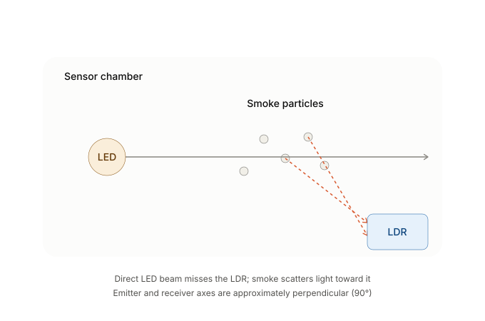
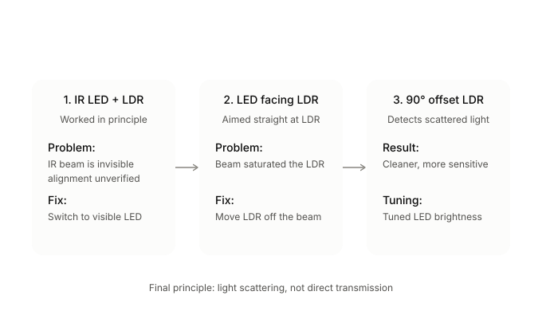
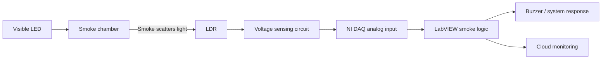

# Custom LED + LDR Smoke Sensor — Build and Design Evolution

## 1. Purpose

The project required a low-cost smoke sensor that could be integrated into the NI DAQ/LabVIEW monitoring system. Instead of using a ready-made smoke module in the final prototype, the detector was built using an **LED and a Light Dependent Resistor (LDR)**.

The final operating principle is **light scattering by smoke particles**.



---

## 2. Core Operating Principle

In clean air, the LED is positioned so that its direct beam does **not** fall onto the LDR.

When smoke enters the chamber, suspended particles scatter part of the LED light. Some of that scattered light reaches the LDR.

```text
CLEAN AIR

LED ─────────────►

                   LDR
                    ▲
                    │
          little/no direct light


WITH SMOKE

LED ─────────────►  •  •  • smoke
                    • ↘
                       ↘ scattered light
                         LDR
```

This changes the LDR resistance. The LDR is used in an electrical sensing circuit so the resistance change becomes a measurable voltage change for the DAQ.

---

## 3. Components Used for the Smoke Detector

The final project documentation directly confirms:

- Visible LED
- LDR
- Smoke chamber/enclosure
- DAQ analog measurement interface
- Supporting wiring and resistor network

The exact resistor values and mechanical chamber dimensions are **not stated in the uploaded final report**, so they should be added from the physical prototype/build notes before claiming exact values in the repository.

---

## 4. Design Evolution



### Iteration 1 — IR LED + LDR

The first concept used an IR LED with an LDR.

**Problem:** IR light is invisible to the human eye. This made it difficult to confirm that the emitter was aimed correctly during construction and troubleshooting.

**Development fix:** A visible LED was used so the beam direction could be verified visually.

---

### Iteration 2 — Visible LED directly facing the LDR

```text
LED ─────────────────► LDR
```

This made physical alignment easy, but it created a new problem.

**Problem:** The direct beam strongly illuminated the LDR, pushing it toward saturation. Introducing smoke caused only a small additional change, because the sensor was already receiving nearly maximum direct illumination.

**Result:** Poor sensitivity to smoke.

---

### Iteration 3 — LED and LDR at approximately 90°

```text
                 LDR
                  ▲
                  │
                  │ scattered light
                  │
LED ─────────►  • • • smoke
```

This became the successful arrangement.

**Why it works:**

- The LED does not shine directly into the LDR.
- Clean air produces a relatively low scattered-light signal.
- Smoke particles scatter LED light sideways.
- The scattered light reaches the LDR.
- The LDR resistance changes.
- The corresponding voltage change can be measured by the DAQ.

This arrangement creates a much larger useful difference between clean-air and smoke conditions than the direct-facing arrangement.

---

## 5. Why Complete Darkness Was Also a Problem

After eliminating direct LED saturation, another issue appeared.

In complete darkness, the LDR moved toward its opposite resistance extreme. A small amount of smoke sometimes failed to create a sufficiently clear voltage change.

### Final tuning

The project documentation states that the team:

1. Allowed a **small amount of ambient light** into the chamber.
2. Adjusted/increased LED brightness enough to make light smoke detectable.
3. Avoided increasing LED brightness so far that the LDR became saturated again.

The goal was therefore to keep the LDR inside its **active operating range**, not at either extreme.

```text
LDR operating region

Dark extreme        Useful active range            Bright saturation
|-------------------[   USE THIS REGION   ]----------------------|
                         ↑
              tuned clean-air operating point
```

---

## 6. Recommended Physical Arrangement

A practical layout matching the documented final principle is:

```text
Top view of smoke chamber

+------------------------------------------------+
|                                                |
| LED                                            |
| [●] ───────────── light path ───────────►      |
|                               smoke inlet      |
|                                • • •           |
|                                • • •           |
|                                  ↘             |
|                                    ↘           |
|                                     [LDR]      |
|                                                |
+------------------------------------------------+

LED axis and LDR viewing direction ≈ 90°
```

### Construction guidelines based on the project findings

- Prevent the LED from directly shining onto the LDR.
- Place the LED and LDR at about 90°.
- Provide a path for smoke to enter the sensing chamber.
- Avoid a completely black chamber if it places the LDR at its unusable extreme.
- Avoid excessive ambient/direct light that saturates the LDR.
- Tune LED brightness experimentally.
- Keep the mechanical arrangement fixed after calibration.

---

## 7. Electrical Measurement Concept

A common way to turn LDR resistance into a voltage is a voltage divider:

```text
 VCC
  |
 [LDR]
  |
  +------ Vout → DAQ analog input
  |
 [R]
  |
 GND
```

or the LDR and resistor may be reversed depending on whether the desired voltage should rise or fall with smoke.

**Important:** The project report confirms an LDR-based voltage response but does not specify the exact resistor value or divider orientation. The circuit above therefore illustrates the measurement principle; replace it with the team's exact final wiring before treating it as the authoritative schematic.

---

## 8. Signal Behaviour

The detector does not directly measure a standardized smoke concentration such as ppm. It produces an **optical response** related to the amount of scattered light reaching the LDR.

Conceptually:

```text
More smoke particles
        ↓
More light scattering
        ↓
Different light level at LDR
        ↓
LDR resistance changes
        ↓
Vout changes
        ↓
DAQ reads voltage
        ↓
LabVIEW evaluates smoke condition
```

The smoke threshold should be determined experimentally from clean-air and test-smoke readings.

---

## 9. Calibration Procedure

A repeatable calibration approach for this project is:

1. Assemble the LED and LDR in their final 90° geometry.
2. Power the LED at the intended brightness.
3. Record the clean-air DAQ voltage.
4. Introduce a small, repeatable amount of test smoke.
5. Record the sensor voltage.
6. Repeat for several smoke levels/trials.
7. Check that clean-air and smoke readings are clearly separated.
8. Adjust LED brightness/ambient leakage if either saturation extreme occurs.
9. Select a LabVIEW threshold with enough margin to avoid false triggering.
10. Re-test after installing the sensor inside the final DB prototype.

Do not invent a numerical threshold unless it comes from the team's recorded measurements.

---

## 10. Issues and Lessons Learned

| Issue | Cause | Solution |
|---|---|---|
| IR alignment could not be checked | IR light invisible | Used visible LED during development |
| Smoke caused little change | Direct LED beam saturated LDR | Moved LED and LDR to 90° |
| Weak smoke response in darkness | LDR near dark extreme | Allowed slight ambient light |
| Light smoke difficult to detect | Insufficient scattered light | Increased LED brightness carefully |
| Risk of re-saturation | Too much illumination | Tune brightness to active operating range |

---

## 11. Final Design Summary



The key design insight was that **direct illumination is not useful for this detector**. The most sensitive configuration came from detecting **scattered light**, with the emitter and receiver approximately perpendicular to each other.

---

## 12. Repository Visuals

- [`../images/smoke-sensor-principle.svg`](../images/smoke-sensor-principle.svg)
- [`../images/smoke-sensor-iterations.svg`](../images/smoke-sensor-iterations.svg)

Replace/add real photographs of the team's completed sensor under `images/` when available.
